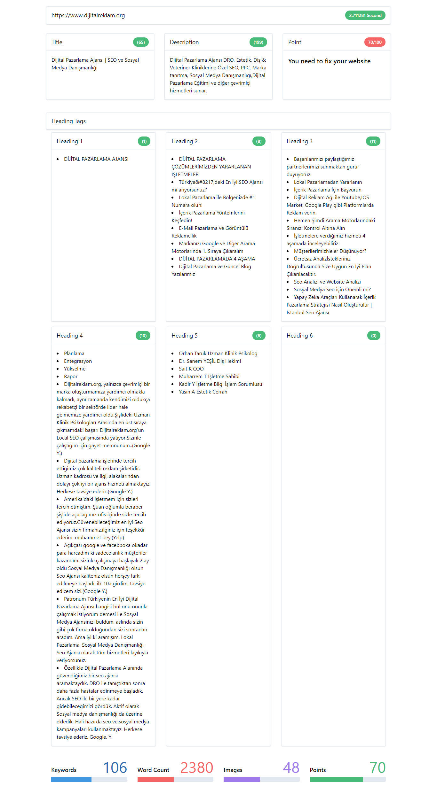
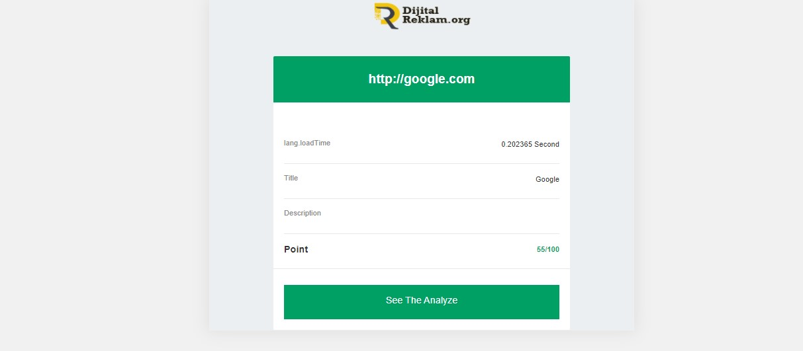

# Laravel 8 one-page SEO Analyzer

This package search for the main content to optimze the SEO results for the content that matters. Ex.: A blog post webpage analyze full webpage and only the blog post text.

Webpage:

-   Get title
-   Get description
-   Loadtime

Full page analyze

-   code To Text Ratio
-   Word Count
-   Keywords
-   Long tail keywords
-   Headers (H1, H2, ...): Count, word count, keywords, long tail keywords
-   Links: Count, word count, keywords, long tail keywords, internal links, external links, follow, nofollow
-   images: Count, Count with alt text, Count words in alt text, keywords, long tail keywords

Point System

-   Analyzing your website content with points.

Mailable

-   Sending blade mail template

Modern View Statistic

-   Created Mail and Statistic view

# Installation

Require this package in your `composer.json` and update composer.

```php
"uyanik13/dro-seo-analyzer": "~1.0"

or run command
composer require uyanik13/dro-seo-analyzer
```

# Documentation

## Usage

```php
Register this provider 'DRO\SeoAnalyzer\SeoServiceProvider::class' to your "app.php" file

Then use php artisan vendor:publish --provider="DRO\SeoAnalyzer\SeoServiceProvider"  command

You can set your email to config file.

# POST METHOD | SEND A PARAMETER {'website','email'}
 https://siteurl/website-analyzer

# GET METHOD | GET ALL WESBITE ANALYZE RECORDS FROM DATABASE AS A PAGINATED
 https://siteurl/all-analyzations

# GET METHOD | GET SPECIIFIC ANALYZE RECORD FROM DATABASE WITH ANALYZE_ID
 https://siteurl/analyze/{id}


```

# Analytic view



# Mail view



If you dont want to use my views:

```php
use DRO\SeoAnalyzer\Seo;

$seo = new Seo();
$result = $seo->analyze('http://www.dijitalreklam.org');


```

# Support

Support github or mail: ogur@dijitalreklam.org

# Contributing

Please try to follow the psr-2 coding style guide. http://www.php-fig.org/psr/psr-2/

# License

This package is licensed under LGPL. You are free to use it in personal and commercial projects. The code can be forked and modified, but the original copyright author should always be included!
